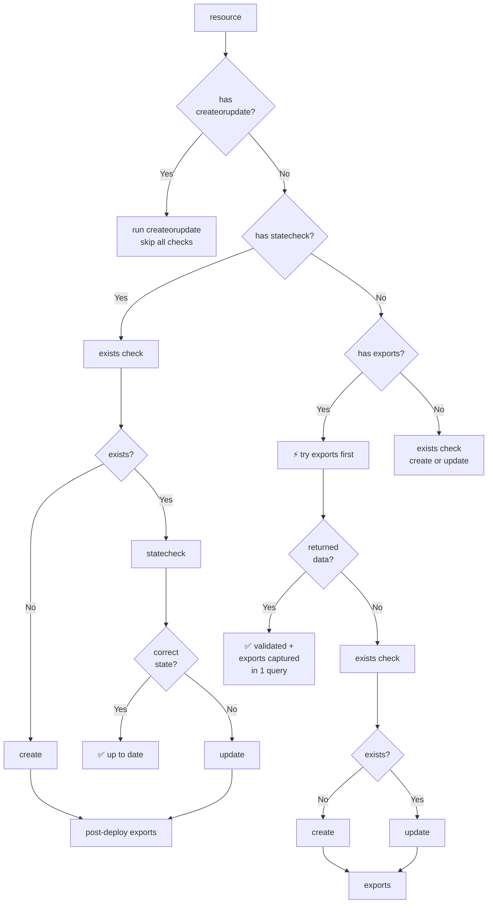

<div align="center">

[](https://github.com/stackql/stackql)

**Model-driven resource provisioning and deployment framework using StackQL.**

[](https://crates.io/crates/stackql-deploy)
[](https://crates.io/crates/stackql-deploy)
[](LICENSE)
[](https://github.com/stackql/stackql-deploy/releases)
[](https://stackql-deploy.io/docs)

</div>

---

**stackql-deploy** is a multi-cloud Infrastructure-as-Code framework inspired by [dbt](https://www.getdbt.com/), built on top of [StackQL](https://github.com/stackql/stackql). Define cloud resources as SQL-like models, then `build`, `test`, and `teardown` across any environment — no state files required.

> This is the Rust rewrite (v2.x). The original Python package (v1.x, last release 1.9.4) is now archived — see its [changelog](https://github.com/stackql/stackql-deploy/blob/main/CHANGELOG.md) for prior history.

## Install

**Via `cargo`:**
```sh
cargo install stackql-deploy
```

**Direct binary download** (Linux, macOS, Windows — x86\_64 and ARM64):

Download the latest release from the [GitHub Releases](https://github.com/stackql/stackql-deploy/releases) page, extract, and place the binary on your `PATH`.

## How it works

A `stackql-deploy` project is a directory with a manifest and StackQL query files:

```
example_stack/
├── stackql_manifest.yml
└── resources/
    └── monitor_resource_group.iql
```

The manifest declares providers, global variables, and resources:

```yaml
version: 1
name: example_stack
description: activity monitor stack
providers:
  - azure
globals:
  - name: subscription_id
    value: "{{ vars.AZURE_SUBSCRIPTION_ID }}"
  - name: location
    value: eastus
resources:
  - name: monitor_resource_group
    description: azure resource group
    props:
      - name: resource_group_name
        value: "activity-monitor-{{ globals.stack_env }}"
```

> Use `stackql-deploy init example_stack --provider azure` to scaffold a new project.

Resource `.iql` files define mutation and check queries using SQL anchors:

```sql
/*+ create */
INSERT INTO azure.resources.resource_groups(
  resourceGroupName, subscriptionId, data__location
)
SELECT '{{ resource_group_name }}', '{{ subscription_id }}', '{{ location }}'

/*+ update */
UPDATE azure.resources.resource_groups
SET data__location = '{{ location }}'
WHERE resourceGroupName = '{{ resource_group_name }}'
  AND subscriptionId = '{{ subscription_id }}'

/*+ delete */
DELETE FROM azure.resources.resource_groups
WHERE resourceGroupName = '{{ resource_group_name }}'
  AND subscriptionId = '{{ subscription_id }}'

/*+ exists */
SELECT COUNT(*) as count FROM azure.resources.resource_groups
WHERE subscriptionId = '{{ subscription_id }}'
  AND resourceGroupName = '{{ resource_group_name }}'

/*+ statecheck, retries=5, retry_delay=5 */
SELECT COUNT(*) as count FROM azure.resources.resource_groups
WHERE subscriptionId = '{{ subscription_id }}'
  AND resourceGroupName = '{{ resource_group_name }}'
  AND location = '{{ location }}'
  AND JSON_EXTRACT(properties, '$.provisioningState') = 'Succeeded'

/*+ exports */
SELECT resourceGroupName, location
FROM azure.resources.resource_groups
WHERE subscriptionId = '{{ subscription_id }}'
  AND resourceGroupName = '{{ resource_group_name }}'
```

### Query execution strategy

For each resource, `stackql-deploy` selects an execution path based on which anchors are defined in the `.iql` file:



**Tip:** when there is no `statecheck`, an `exports` query that selects from the live resource serves as both a validation and data-extraction step in a single API call.

## Usage

```sh
# Preview what would change (no mutations)
stackql-deploy build example_stack dev --dry-run

# Deploy
stackql-deploy build example_stack dev -e AZURE_SUBSCRIPTION_ID=00000000-0000-0000-0000-000000000000

# Run checks only
stackql-deploy test example_stack dev

# Deprovision (reverse order)
stackql-deploy teardown example_stack dev
```

Common flags:

| Flag | Description |
|---|---|
| `--dry-run` | Print queries, make no changes |
| `--on-failure=rollback` | `rollback`, `ignore`, or `error` (default) |
| `--env-file=.env` | Load environment variables from a file |
| `-e KEY=value` | Pass individual environment variables |
| `--log-level` | `DEBUG`, `INFO`, `WARNING`, `ERROR`, `CRITICAL` |
| `--show-queries` | Print rendered SQL before execution |

Show environment and provider info:

```sh
stackql-deploy info
```

Full command reference:

```sh
stackql-deploy --help
```

## Documentation

Full documentation — manifest reference, query anchors, template filters, provider examples — is at **[stackql-deploy.io/docs](https://stackql-deploy.io/docs)**.

## License

MIT — see [LICENSE](LICENSE).
