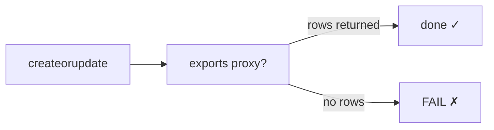
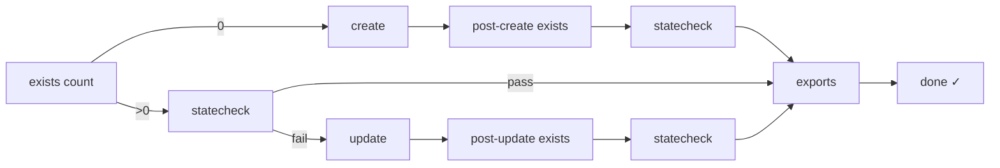
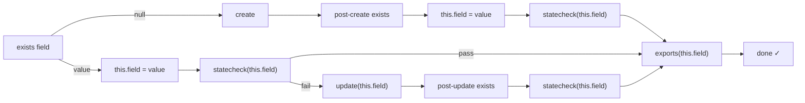
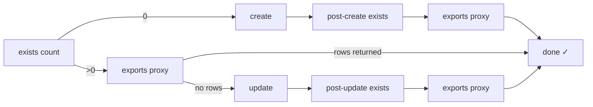
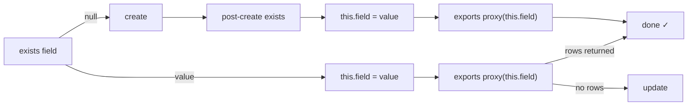
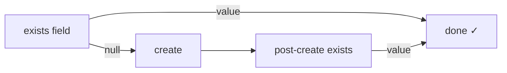
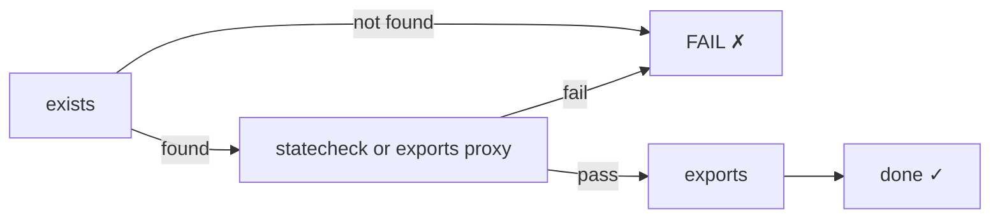
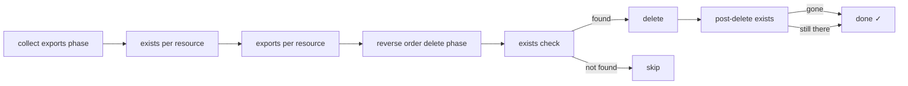

# Resource Processing Flows

This document describes every code path in the `build`, `test`, and `teardown` commands based on which anchors are present in a resource's `.iql` file.

## Anchor Reference

| Anchor | Purpose |
|--------|---------|
| `exists` | Check if resource exists (returns `count` or a named field) |
| `statecheck` | Verify resource properties match desired state |
| `create` | Create the resource |
| `update` | Update the resource (patch document) |
| `createorupdate` | Always execute (skip exists/statecheck) |
| `exports` | Extract values for downstream resources |
| `delete` | Remove the resource |

## Exists Query Variants

The `exists` query has two modes based on the returned column name:

**Count mode** — returns `count`, existence is `count > 0`:
```sql
SELECT count(*) as count FROM awscc.s3.buckets WHERE Identifier = '{{ bucket_name }}' AND region = '{{ region }}';
```

**Field capture mode** — returns a named field (e.g. `vpc_id`), captured as `this.<field>` for downstream queries:
```sql
SELECT split_part(ResourceARN, '/', 2) as vpc_id FROM awscc.tagging.tagged_resources WHERE ...;
```

When `null` or empty is returned in field capture mode, the resource is treated as non-existent.

---

## Build Flows

### Flow A: `createorupdate` + `exports`

Used for resources that should always be applied (e.g. routes, gateway attachments).



**Anchors:** `createorupdate`, optionally `exports`
**Examples:** `example_inet_route`, `example_inet_gw_attachment` (old pattern)

---

### Flow B: `exists`(count) + `statecheck` + `create`/`update` + `exports`

Classic pattern for resources identified by a known name/identifier.



**Anchors:** `exists`(count), `statecheck`, `create`, optionally `update`, optionally `exports`
**Examples:** `databricks_account_credentials`, `aws_s3_workspace_bucket_policy`

---

### Flow C: `exists`(field) + `statecheck` + `create` + `exports`

Pattern for awscc resources using tagging for identification. The exists query returns a resource-specific field (e.g. `vpc_id`) which is captured as `this.<field>` and used in statecheck and exports.



**Anchors:** `exists`(field), `statecheck`, `create`, optionally `update`, `exports`
**Examples:** `example_vpc`, `example_subnet`, `example_inet_gateway`, `example_route_table`, `example_security_group`, `example_web_server`

---

### Flow D: `exists`(count) + `exports`-as-proxy (no statecheck)

The exports query doubles as a statecheck — if it returns rows, the resource is in the desired state.



**Anchors:** `exists`(count), `create`, optionally `update`, `exports`
**Examples:** `aws_s3_workspace_bucket`, `databricks_storage_configuration`

---

### Flow E: `exists`(field) + `exports` (no statecheck)

Field capture from exists, exports uses `this.<field>`. Exports acts as statecheck proxy.



**Anchors:** `exists`(field), `create`, `exports`
**Examples:** `example_subnet_rt_assn`

---

### Flow F: `exists`(field) only (no statecheck, no exports)

Minimal pattern — exists confirms the resource, the captured field is the only output.



**Anchors:** `exists`(field), `create`
**Examples:** Simple resources where existence is sufficient

---

## Test Flows

Test runs the same exists → statecheck/exports-proxy sequence as build, but never creates or updates. If a resource doesn't exist or fails statecheck, the test fails.



---

## Teardown Flows

Teardown processes resources in reverse manifest order. First collects all exports (running exists to capture `this.*` fields), then deletes.



During teardown export collection, missing exports are set to `<unknown>` rather than failing — the stack may be partially deployed.

---

## `this.*` Variable Lifecycle

When an exists query returns a named field (not `count`), the value is captured as a resource-scoped variable:

| Phase | Variable | Available to |
|-------|----------|-------------|
| exists returns `vpc_id` | `this.vpc_id` → `example_vpc.vpc_id` | statecheck, exports, delete for this resource |
| exports returns `vpc_id` | `vpc_id` and `example_vpc.vpc_id` | all subsequent resources |

The `this.*` prefix is syntactic sugar — `{{ this.vpc_id }}` in `example_vpc`'s queries is preprocessed to `{{ example_vpc.vpc_id }}`.

---

## RETURNING * Optimization

When a `create` query includes `RETURNING *`, the Cloud Control API returns the operation metadata immediately. If `return_vals` is configured in the manifest, specified fields are captured as `this.*` variables, eliminating the need for a post-create exists re-run.

```yaml
resources:
  - name: example_vpc
    return_vals:
      create:
        - Identifier: vpc_id    # rename Identifier → this.vpc_id
        - ErrorCode             # capture as this.ErrorCode
```
