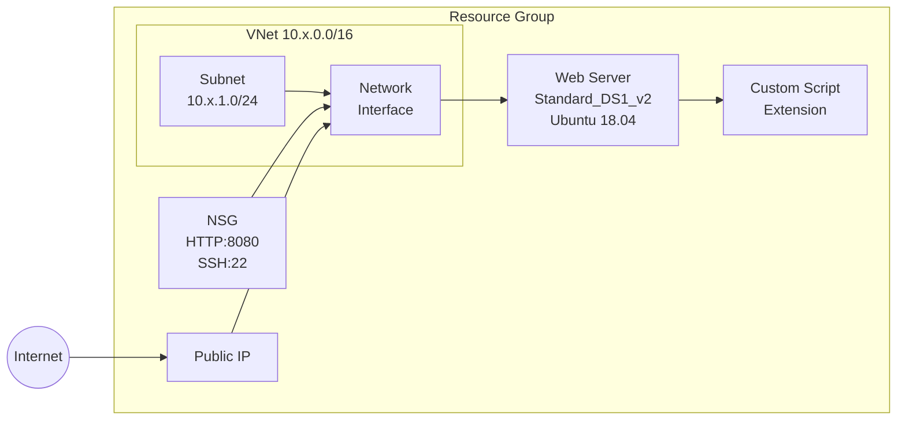

# Azure Web Server Example

This example provisions an Azure networking stack with a web server VM using the `azure` provider.

## Architecture



## Resources

| # | Resource | Provider Resource | Description |
|---|----------|-------------------|-------------|
| 1 | `example_resource_group` | `azure.resources.resource_groups` | Resource group for all stack resources |
| 2 | `example_vnet` | `azure.network.virtual_networks` | Virtual network with environment-specific CIDR |
| 3 | `example_subnet` | `azure.network.subnets` | Subnet within the VNet |
| 4 | `example_public_ip` | `azure.network.public_ip_addresses` | Static public IP for the VM |
| 5 | `example_nsg` | `azure.network.network_security_groups` | NSG allowing HTTP (8080) and SSH (22 from VNet) |
| 6 | `example_nic` | `azure.network.network_interfaces` | NIC with subnet, public IP, and NSG |
| 7 | `example_web_server` | `azure.compute.virtual_machines` | Ubuntu 18.04 VM (Standard_DS1_v2) |
| 8 | `example_vm_ext` | `azure.compute.virtual_machine_extensions` | Custom script extension to start a web server |

## Environment-Specific CIDR Blocks

| Environment | VNet CIDR | Subnet CIDR |
|-------------|-----------|-------------|
| `prd` | 10.0.0.0/16 | 10.0.1.0/24 |
| `sit` | 10.1.0.0/16 | 10.1.1.0/24 |
| `dev` | 10.2.0.0/16 | 10.2.1.0/24 |

## Prerequisites

- `stackql-deploy` installed ([releases](https://github.com/stackql/stackql-deploy-rs/releases))
- Azure service principal credentials set as environment variables (used for provider authentication):

  ```bash
  export AZURE_TENANT_ID=your_tenant_id
  export AZURE_CLIENT_ID=your_client_id
  export AZURE_CLIENT_SECRET=your_client_secret
  ```

- Stack-specific variables passed via `-e` flags (mapped to manifest globals):
  - `AZURE_SUBSCRIPTION_ID` - your Azure subscription ID
  - `AZURE_VM_ADMIN_PASSWORD` - password for the VM admin user

  For more information on authentication, see the [`azure` provider documentation](https://azure.stackql.io/providers/azure).

## Usage

### Deploy

```bash
target/release/stackql-deploy build examples/azure/azure-web-server dev \
  -e AZURE_SUBSCRIPTION_ID=${AZURE_SUBSCRIPTION_ID} \
  -e AZURE_VM_ADMIN_PASSWORD=${AZURE_VM_ADMIN_PASSWORD}
```

### Test

```bash
stackql-deploy test examples/azure/azure-web-server dev \
  -e AZURE_SUBSCRIPTION_ID=${AZURE_SUBSCRIPTION_ID} \
  -e AZURE_VM_ADMIN_PASSWORD=${AZURE_VM_ADMIN_PASSWORD}
```

### Teardown

```bash
stackql-deploy teardown examples/azure/azure-web-server dev \
  -e AZURE_SUBSCRIPTION_ID=${AZURE_SUBSCRIPTION_ID} \
  -e AZURE_VM_ADMIN_PASSWORD=${AZURE_VM_ADMIN_PASSWORD}
```

### Debug mode

```bash
stackql-deploy build examples/azure/azure-web-server dev \
  -e AZURE_SUBSCRIPTION_ID=${AZURE_SUBSCRIPTION_ID} \
  -e AZURE_VM_ADMIN_PASSWORD=${AZURE_VM_ADMIN_PASSWORD} \
  --log-level debug
```
