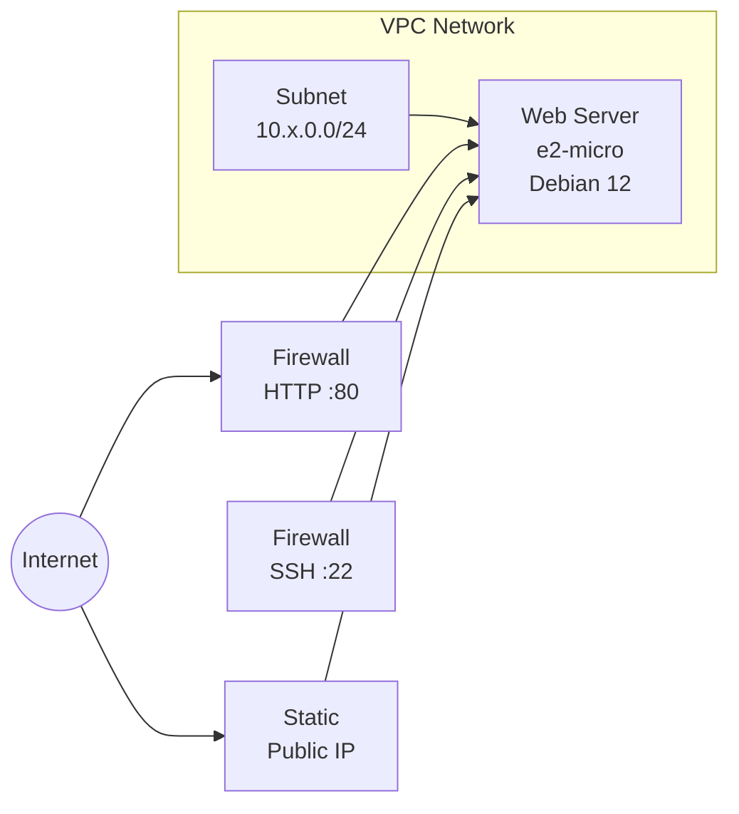

# Google Cloud Web Server Example

This example provisions a Google Cloud networking stack with an Apache web server using the `google` provider.

## Architecture



## Resources

| # | Resource | Provider Resource | Description |
|---|----------|-------------------|-------------|
| 1 | `example_network` | `google.compute.networks` | Custom-mode VPC network |
| 2 | `example_subnetwork` | `google.compute.subnetworks` | Regional subnet with private Google access |
| 3 | `example_firewall_http` | `google.compute.firewalls` | Allow HTTP (port 80) from anywhere |
| 4 | `example_firewall_ssh` | `google.compute.firewalls` | Allow SSH (port 22, restricted by environment) |
| 5 | `example_public_ip` | `google.compute.addresses` | Static external IP address |
| 6 | `example_web_server` | `google.compute.instances` | e2-micro VM running Apache on Debian 12 |
| 7 | `get_web_server_url` | *(query)* | Constructs the web server URL from the static IP |

## Environment-Specific CIDR Blocks

| Environment | Subnet CIDR | SSH Source |
|-------------|-------------|-----------|
| `prd` | 10.0.0.0/24 | VPC only (10.0.0.0/24) |
| `sit` | 10.1.0.0/24 | VPC only (10.1.0.0/24) |
| `dev` | 10.2.0.0/24 | Anywhere (0.0.0.0/0) |

## Prerequisites

- `stackql-deploy` installed ([releases](https://github.com/stackql/stackql-deploy-rs/releases))
- Google Cloud credentials:

```bash
export GOOGLE_CREDENTIALS=$(cat path/to/sa-key.json)
export GOOGLE_PROJECT=stackql-demo
export GOOGLE_REGION=us-central1
export GOOGLE_ZONE=us-central1-a
 ```

## Usage

### Deploy

```bash
target/release/stackql-deploy build \
examples/google/google-web-server dev \
-e GOOGLE_PROJECT=${GOOGLE_PROJECT} \
-e GOOGLE_REGION=${GOOGLE_REGION} \
-e GOOGLE_ZONE=${GOOGLE_ZONE}
```
### Test

```bash
stackql-deploy test examples/google/google-web-server dev
```

### Teardown

```bash
stackql-deploy teardown examples/google/google-web-server dev
```

### Debug mode

```bash
stackql-deploy build examples/google/google-web-server dev --log-level debug
```
