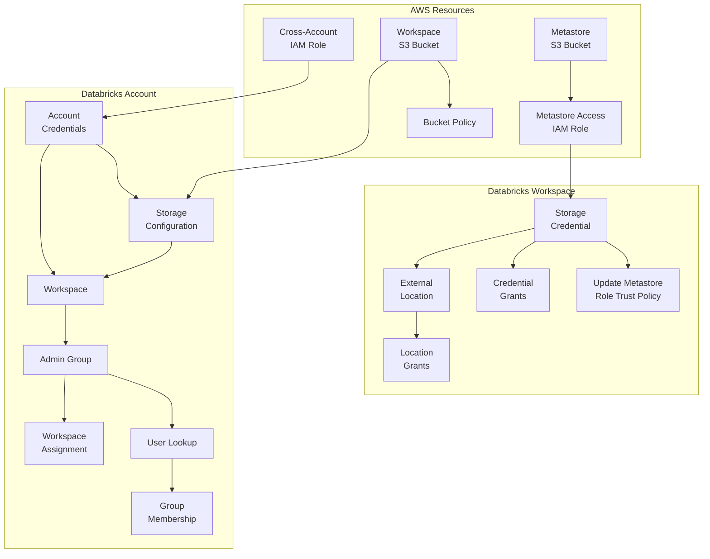

import Tabs from '@theme/Tabs';
import TabItem from '@theme/TabItem';

This example demonstrates a multi-provider stack that provisions a complete Databricks serverless workspace on AWS using `stackql-deploy`.  The stack spans three providers: `awscc` for AWS Cloud Control resources, `databricks_account` for Databricks account-level operations, and `databricks_workspace` for workspace-level configuration.

## Stack Overview

The stack provisions the following resources in order:



| # | Resource | Provider | Description |
|---|----------|----------|-------------|
| 1 | `aws_cross_account_role` | `awscc.iam.roles` | IAM role for Databricks cross-account access |
| 2 | `databricks_account_credentials` | `databricks_account.provisioning.credentials` | Registers the IAM role as a credential configuration |
| 3 | `aws_s3_workspace_bucket` | `awscc.s3.buckets` | Root S3 bucket for workspace storage |
| 4 | `aws_s3_workspace_bucket_policy` | `awscc.s3.bucket_policies` | Grants Databricks access to the workspace bucket |
| 5 | `databricks_storage_configuration` | `databricks_account.provisioning.storage` | Registers the S3 bucket as a storage configuration |
| 6 | `aws_s3_metastore_bucket` | `awscc.s3.buckets` | S3 bucket for Unity Catalog metastore |
| 7 | `aws_metastore_access_role` | `awscc.iam.roles` | IAM role for Unity Catalog metastore S3 access |
| 8 | `databricks_workspace` | `databricks_account.provisioning.workspaces` | The Databricks workspace itself |
| 9 | `workspace_admins_group` | `databricks_account.iam.account_groups` | Admin group for the workspace |
| 10 | `get_databricks_users` | `databricks_account.iam.users` | Looks up user IDs for group membership *(query)* |
| 11 | `databricks_account/update_group_membership` | `databricks_account.iam.account_groups` | Adds users to the admin group *(command)* |
| 12 | `databricks_account/workspace_assignment` | `databricks_account.iam.workspace_assignment` | Assigns the admin group to the workspace *(command)* |
| 13 | `databricks_workspace/storage_credentials` | `databricks_workspace.catalog.storage_credentials` | Unity Catalog storage credential |
| 14 | `aws/iam/update_metastore_access_role` | `awscc.iam.roles` | Updates the metastore role trust policy with the external ID *(command)* |
| 15 | `databricks_credential_grants` | `databricks_workspace.catalog.grants` | Grants privileges on the storage credential *(command)* |
| 16 | `external_location` | `databricks_workspace.catalog.external_locations` | Unity Catalog external location |
| 17 | `databricks_workspace/unitycatalog/location_grants` | `databricks_workspace.catalog.grants` | Grants privileges on the external location *(command)* |

## Prerequisites

- `stackql-deploy` installed ([releases](https://github.com/stackql/stackql-deploy-rs/releases))
- Environment variables:

  ```bash
  export AWS_ACCESS_KEY_ID=your_aws_access_key
  export AWS_SECRET_ACCESS_KEY=your_aws_secret_key
  export AWS_REGION=us-east-1
  export AWS_ACCOUNT_ID=your_aws_account_id
  export DATABRICKS_ACCOUNT_ID=your_databricks_account_id
  export DATABRICKS_AWS_ACCOUNT_ID=414351767826
  export DATABRICKS_CLIENT_ID=your_databricks_client_id
  export DATABRICKS_CLIENT_SECRET=your_databricks_client_secret
  ```

## Deploying the Stack

```bash
stackql-deploy build examples/databricks/serverless dev
```

Dry run:

```bash
stackql-deploy build examples/databricks/serverless dev --dry-run --show-queries
```

Testing the stack:

```bash
stackql-deploy test examples/databricks/serverless dev
```

Tearing down:

```bash
stackql-deploy teardown examples/databricks/serverless dev
```

## stackql_manifest.yml

The manifest demonstrates several advanced features including multi-provider stacks, version-pinned providers, `file()` directives for externalized policy documents, the `return_vals` construct for capturing identifiers from `RETURNING` clauses, and `command` and `query` resource types alongside standard `resource` types.

<details>
  <summary>Click to expand the <code>stackql_manifest.yml</code> file</summary>

```yaml
version: 1
name: "stackql-serverless"
description: creates a serverless databricks workspace
providers:
  - awscc::v26.03.00379
  - databricks_account::v26.03.00381
  - databricks_workspace::v26.03.00381
globals:
  - name: databricks_account_id
    description: databricks account id
    value: "{{ DATABRICKS_ACCOUNT_ID }}"
  - name: databricks_aws_account_id
    description: databricks AWS account id
    value: "{{ DATABRICKS_AWS_ACCOUNT_ID }}"
  - name: aws_account
    description: aws_account id
    value: "{{ AWS_ACCOUNT_ID }}"
  - name: region
    description: aws region
    value: "{{ AWS_REGION }}"
  - name: global_tags
    value:
      - Key: 'stackql:stack-name'
        Value: "{{ stack_name }}"
      - Key: 'stackql:stack-env'
        Value: "{{ stack_env }}"
      - Key: 'stackql:resource-name'
        Value: "{{ resource_name }}"

# ... resources defined in order of dependencies
# see full manifest in the examples/databricks/serverless directory

exports:
  - workspace_name
  - workspace_id
  - deployment_name
  - workspace_status
  - workspace_url
```

</details>

## Resource Query Files

<Tabs
  defaultValue="iam_role"
  values={[
    { label: 'aws/iam/roles.iql', value: 'iam_role', },
    { label: 'databricks_account/workspaces.iql', value: 'workspace', },
    { label: 'databricks_account/account_groups.iql', value: 'groups', },
  ]}
>
<TabItem value="iam_role">

This resource demonstrates the `create`/`update`/`statecheck`/`exports` pattern with Cloud Control, using `generate_patch_document` for updates and `AWS_POLICY_EQUAL` for policy comparison in the statecheck.

```sql
/*+ exists */
SELECT count(*) as count
FROM awscc.iam.roles
WHERE region = 'us-east-1' AND
Identifier = '{{ role_name }}';

/*+ create */
INSERT INTO awscc.iam.roles (
 AssumeRolePolicyDocument, Description, ManagedPolicyArns,
 MaxSessionDuration, Path, PermissionsBoundary,
 Policies, RoleName, Tags, region
)
SELECT
 '{{ assume_role_policy_document }}', '{{ description }}',
 '{{ managed_policy_arns }}', '{{ max_session_duration }}',
 '{{ path }}', '{{ permissions_boundary }}',
 '{{ policies }}', '{{ role_name }}', '{{ tags }}', 'us-east-1';

/*+ update */
UPDATE awscc.iam.roles
SET PatchDocument = string('{{ {
    "AssumeRolePolicyDocument": assume_role_policy_document,
    "Description": description,
    "ManagedPolicyArns": managed_policy_arns,
    "MaxSessionDuration": max_session_duration,
    "PermissionsBoundary": permissions_boundary,
    "Path": path,
    "Policies": policies,
    "Tags": tags
} | generate_patch_document }}')
WHERE region = 'us-east-1'
AND Identifier = '{{ role_name }}';

/*+ statecheck, retries=5, retry_delay=10 */
SELECT COUNT(*) as count FROM (
    SELECT
        max_session_duration, path,
        AWS_POLICY_EQUAL(assume_role_policy_document,
          '{{ assume_role_policy_document }}') as test_assume_role_policy_doc,
        AWS_POLICY_EQUAL(policies, '{{ policies }}') as test_policies
    FROM awscc.iam.roles
    WHERE Identifier = '{{ role_name }}' AND region = 'us-east-1')t
WHERE test_assume_role_policy_doc = 1
AND test_policies = 1
AND path = '{{ path }}';

/*+ exports */
SELECT arn, role_name
FROM awscc.iam.roles
WHERE region = 'us-east-1' AND
Identifier = '{{ role_name }}';

/*+ delete */
DELETE FROM awscc.iam.roles
WHERE Identifier = '{{ role_name }}'
AND region = 'us-east-1';
```

</TabItem>
<TabItem value="workspace">

The workspace resource uses the standard `count`-based exists pattern with Databricks account-level APIs.  The `exports` query constructs the `workspace_url` using string concatenation.

```sql
/*+ exists */
SELECT count(*) as count
FROM databricks_account.provisioning.workspaces
WHERE account_id = '{{ account_id }}'
AND workspace_name = '{{ workspace_name }}';

/*+ create */
INSERT INTO databricks_account.provisioning.workspaces (
  aws_region, credentials_id, pricing_tier,
  storage_configuration_id, workspace_name, account_id
)
SELECT
  '{{ aws_region }}', '{{ credentials_id }}',
  '{{ pricing_tier }}', '{{ storage_configuration_id }}',
  '{{ workspace_name }}', '{{ account_id }}';

/*+ statecheck, retries=5, retry_delay=10 */
SELECT count(*) as count
FROM databricks_account.provisioning.workspaces
WHERE credentials_id = '{{ credentials_id }}'
AND storage_configuration_id = '{{ storage_configuration_id }}'
AND workspace_name = '{{ workspace_name }}'
AND aws_region = '{{ aws_region }}'
AND pricing_tier = '{{ pricing_tier }}'
AND account_id = '{{ account_id }}';

/*+ exports */
SELECT workspace_name, workspace_id, deployment_name,
  workspace_status,
  'https://' || deployment_name || '.cloud.databricks.com' AS workspace_url
FROM databricks_account.provisioning.workspaces
WHERE account_id = '{{ account_id }}'
AND workspace_name = '{{ workspace_name }}';

/*+ delete */
DELETE FROM databricks_account.provisioning.workspaces
WHERE account_id = '{{ account_id }}'
AND workspace_id = '{{ workspace_id }}';
```

</TabItem>
<TabItem value="groups">

This resource demonstrates the **identifier capture** pattern with `return_vals`.  The `exists` query returns a named field (`databricks_group_id`), and the `create` uses `RETURNING id` with `return_vals` in the manifest to map the provider's `id` field to `databricks_group_id`.

```sql
/*+ exists */
SELECT id AS databricks_group_id
FROM databricks_account.iam.account_groups
WHERE account_id = '{{ databricks_account_id }}'
AND filter = 'displayName Eq "{{ display_name }}"';

/*+ create */
INSERT INTO databricks_account.iam.account_groups (
  displayName, account_id
)
SELECT '{{ display_name }}', '{{ databricks_account_id }}'
RETURNING id;

/*+ exports */
SELECT '{{ this.databricks_group_id }}' as databricks_group_id,
'{{ display_name }}' as display_name;

/*+ delete */
DELETE FROM databricks_account.iam.account_groups
WHERE account_id = '{{ databricks_account_id }}'
AND id = '{{ databricks_group_id }}';
```

Manifest `return_vals` configuration:

```yaml
return_vals:
  create:
    - id: databricks_group_id
```

</TabItem>
</Tabs>

## Key Patterns

### Multi-Provider Stacks

This stack uses three providers with version pinning:

```yaml
providers:
  - awscc::v26.03.00379
  - databricks_account::v26.03.00381
  - databricks_workspace::v26.03.00381
```

### Externalized Policy Documents

Complex IAM policy statements are stored as JSON files and loaded using the `file()` directive:

```yaml
policies:
  - PolicyDocument:
      Statement:
        - file(aws/iam/policy_statements/cross_account_role/ec2_permissions.json)
        - file(aws/iam/policy_statements/cross_account_role/iam_service_linked_role.json)
      Version: '2012-10-17'
    PolicyName: "{{ stack_name }}-{{ stack_env }}-policy"
```

### `return_vals` for Identifier Capture

When a provider returns an identifier during creation that can't be predicted (e.g. auto-generated IDs), use `return_vals` to capture it:

```yaml
return_vals:
  create:
    - id: databricks_group_id  # maps provider field 'id' to 'databricks_group_id'
```

### Stack-Level Exports

The manifest defines stack-level exports that are displayed after a successful `build` or `test` and written to `.stackql-deploy-exports` for sourcing into the shell:

```yaml
exports:
  - workspace_name
  - workspace_id
  - deployment_name
  - workspace_status
  - workspace_url
```

## More Information

The complete code for this example stack is available [__here__](https://github.com/stackql/stackql-deploy-rs/tree/main/examples/databricks/serverless).  For more information:

- [`databricks_account` provider docs](https://databricks-account.stackql.io/providers/databricks_account/)
- [`databricks_workspace` provider docs](https://databricks-workspace.stackql.io/providers/databricks_workspace/)
- [`awscc` provider docs](https://awscc.stackql.io/providers/awscc/)
- [`stackql`](https://github.com/stackql/stackql)
- [`stackql-deploy` GitHub repo](https://github.com/stackql/stackql-deploy-rs)
